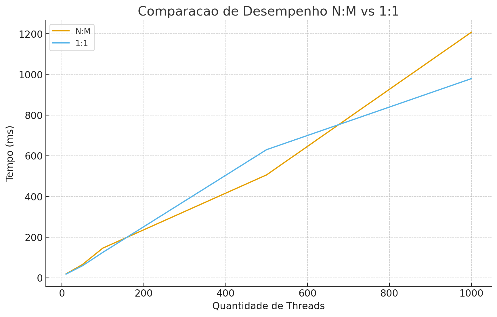

# Relatório de Comparação: Modelos de Threads N:M vs 1:1

## 📊 Resultados Obtidos

| Quantidade de Threads | Modelo N:M | Modelo 1:1 | Vencedor | Diferença |
|----------------------|------------|------------|----------|-----------|
| 10 threads           | 19ms       | 18ms       | 1:1      | +1ms      |
| 50 threads           | 65ms       | 59ms       | 1:1      | +6ms      |
| 100 threads          | 146ms      | 125ms      | 1:1      | +21ms     |
| 500 threads          | 506ms      | 630ms      | N:M      | +124ms    |
| 1000 threads         | 1207ms     | 979ms      | 1:1      | +228ms    |

## 📈 Análise dos Resultados

O modelo 1:1 foi mais rápido na maioria dos cenários com poucas e médias quantidades de threads (10, 50 e 100). Isso acontece porque cada thread da aplicação é mapeada diretamente para uma thread do sistema operacional, evitando gastos extras com gerenciamento.

Quando chega em 500 threads, o modelo N:M finalmente leva vantagem. Nesse caso, ele consegue distribuir melhor as threads em um número menor de threads do sistema e reduz a sobrecarga. Mas quando vai para 1000 threads, o desempenho do N:M cai e o 1:1 volta a ser mais eficiente, provavelmente porque o agendamento e o gerenciamento interno do pool no N:M começam a ficar pesados.

